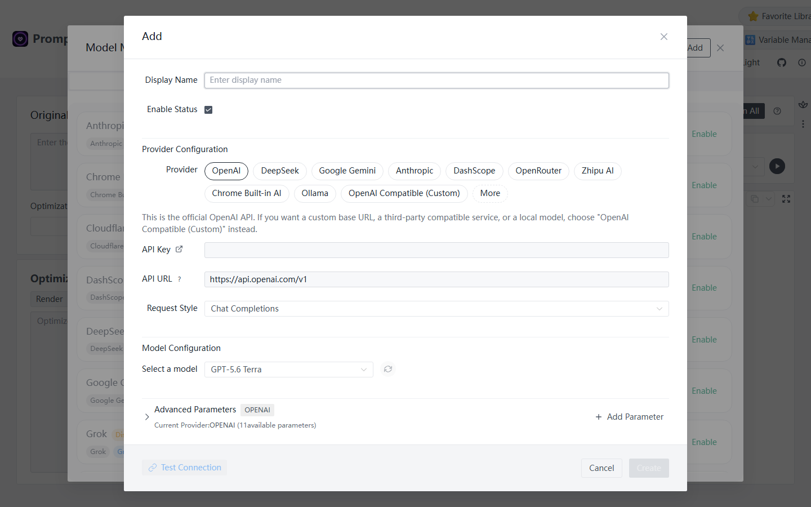
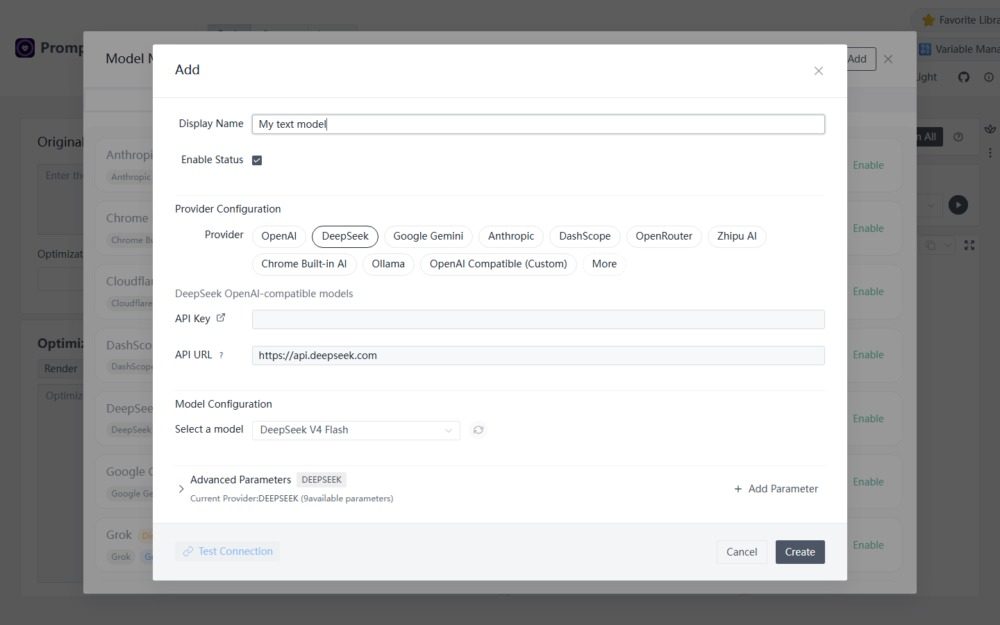

# Model Management

Prompt Optimizer uses models you connect to analyze, improve, and test prompts. Start with **one text model**. Add an image model later if you need image generation.

## Before you start {#before-you-start}

An online model usually needs an **API key** from its provider. Enable API access and create a key in that provider's console; the link next to **API Key** in the model form may take you there. An API key is a credential for calling the model, not your Prompt Optimizer password. Chat subscriptions and API usage may be billed and managed separately. Check your provider's console for access, quotas, and charges.

If you do not have an account yet, choose a built-in provider from which you can obtain a key. Never publish a real key in a screenshot. For a local model, see [Local models](#local-model).

## Connect your first text model {#first-text-model}

The form below uses **DeepSeek** as an example. Use a provider and model available to your own account. The screenshot was taken in September 2026; available model names can change.

1. Open the [online optimizer](https://prompt.always200.com/#/basic/user) or the desktop app. Click **Model Manager** at the top.
2. Stay on **Text Models** and click **Add**.
3. Fill the form as below, leaving **Enabled** selected.

*The form initially selects OpenAI. Switch to the provider you actually use.*

| Field | What to enter |
| --- | --- |
| Display Name | A name you recognize, such as “My text model” |
| Provider | **DeepSeek** for this example, or your own provider |
| API Key | The key from that provider's console, not a chat account password |
| API URL | Keep the automatically filled URL for a built-in official provider |
| Select Model | A model that your account can actually call |
| Advanced Parameters | Keep the defaults for the first run |

*Screenshot of the Chinese online UI. The API key is empty; the selected model only reflects the UI at capture time.*

4. Click **Test Connection**. After a success message, click **Create**. Check that your display name appears in the list and the model is enabled.
5. Close Model Manager, return to the user prompt workspace, and select that model in **Optimization Model**. Continue with [Quick Start](../user/quick-start.md#enter-prompt).

If the connection fails, check the key, account quota, and model access, then see [Connection Issues](../help/connection-issues.md). **A successful connection test only confirms that test request.** A later optimization can still fail because of quota, model capability, or network changes.

## What the fields mean {#fields}

- **Display Name** identifies this configuration inside the app. It does not change the provider's model ID.
- **Provider** selects the API adapter and default URL. Use the named provider for its official API; choose **OpenAI Compatible (Custom)** for a compatible third-party service.
- **API Key** is your provider credential. Do not put it in a public frontend deployment.
- **API URL** determines where requests go. Leave the default for official built-in providers unless your provider requires another URL.
- **Select Model** chooses the actual model to call. Confirm your account has access to it.
- **Request Style and Advanced Parameters** usually need no changes for a first run.

## How many models do you need? {#model-types}

| Goal | Minimum setup |
| --- | --- |
| Improve and copy a text prompt | One text model |
| Compare the original and revised prompts using the same model | The same one text model |
| Compare different models | Add a second text model |
| Improve an image prompt and actually generate an image | One text model plus one image model |
| Extract information from a reference image, replicate, or learn a style | Also configure a vision-capable function model where required |

In text workspaces, **Optimization Model** on the left rewrites the prompt. The model selected for a test on the right executes that prompt. The same text model can serve both roles. Evaluation also calls a text model; its selection follows the workspace's test and evaluation settings. See [Testing & Evaluation](../user/testing-evaluation.md).

## Other connection types {#other-providers}

### Another official provider

Select its provider in the **Add** form, enter its API key, choose a model available to your account, and test the connection. Some providers have a link to their key console in the form. Keep the prefilled API URL unless the provider tells you to change it.

### Local models {#local-model}

For Ollama, select the built-in **Ollama** provider. Start Ollama and install a model first, then choose one of the models available on your computer. The default URL is usually `http://localhost:11434/v1`; an API key is generally not required.

For LM Studio or another OpenAI-compatible service, select **OpenAI Compatible (Custom)**. Enter the service's actual URL, model ID, and any required key. The [desktop app](../deployment/desktop.md) is the easier choice for local or private-network HTTP services; a browser may block those requests.

### Image and function models

Add a generation model under **Image Models** to produce images. Improving the image prompt on the left still needs a text model. Reference-image replication and style learning also need a vision-capable model under **Function Models**. See [Text-to-Image Workspace](../image/text2image-workspace.md).

## Common setup problems {#setup-problems}

| Symptom | First check |
| --- | --- |
| New model is missing from **Optimization Model** | Was it created, enabled, and added under **Text Models**? |
| `401` or authentication failure | Does the key belong to the selected provider, and is the account active? |
| `404` or model not found | Is the selected model available to that account, and does the URL match the provider? |
| Network error or CORS in the browser | See [Connection Issues](../help/connection-issues.md); try the desktop app for a local service |
| Test Connection worked, but optimization fails | Check runtime quota, model capabilities, and the detailed error |

Configuration is saved in the current browser, desktop app, or extension environment. Use [Data Management](data.md) before moving to another device, and inspect backups for API keys before sharing them.
