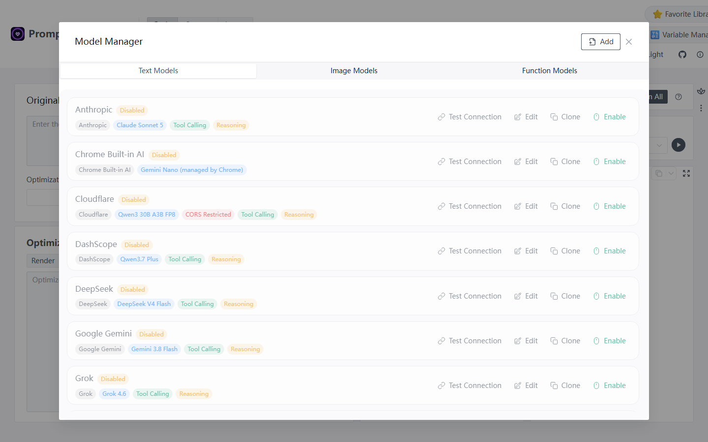
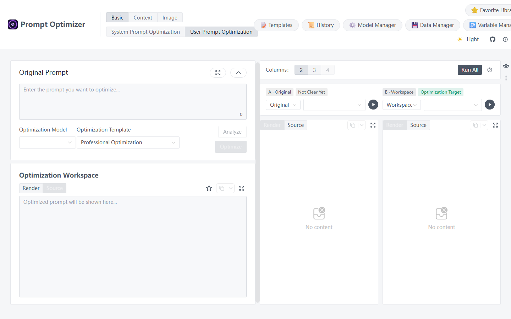
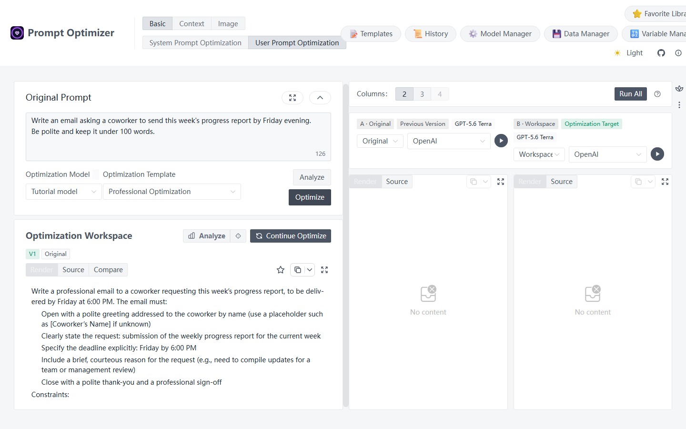

# Quick Start: Improve Your First Prompt

This guide starts with model setup and ends with an improved prompt you can copy. You need one working text model for the first run.

!!! warning "Before you begin"
    Prompt Optimizer does not include a ready-to-use online model. Bring an API key from your model provider, or use a local model that is already running. A chat subscription and API access may be managed separately by the provider. See [Model Management](../basic/models.md) for the full setup.

## 1. Connect a text model

1. Open the [online optimizer](https://prompt.always200.com/#/basic/user) or the desktop app.
2. Click **Model Manager** at the top. Stay on **Text Models** and click **Add**.
3. Enter a display name, choose a provider for which you have an API key, enter the key, and select a model your account can use. For a built-in official provider, keep the automatically filled API URL at first.
4. Click **Test Connection**. When it succeeds, click **Create** and make sure the model is enabled.

If you do not have an API key yet, read [Model Management: Before you start](../basic/models.md#before-you-start). For connection errors, see [Connection Issues](../help/connection-issues.md).

*The screenshot shows the online UI without configured keys. Preset entries are disabled until you configure and enable a model.*

## 2. Enter a task prompt {#enter-prompt}

At the top, open **Basic → User Prompt Optimization**. In **Original Prompt** on the left, enter:

> Write an email asking a coworker to send this week's progress report by Friday evening. Be polite and keep it under 100 words.

Choose your new model in **Optimization Model**. Leave the optimization template on its default setting for now.

*The screenshot shows where to click; the example prompt and API key were not entered when it was captured.*

## 3. Improve and copy the prompt

Click **Optimize** on the left. When generation ends, read the revised prompt in **Optimization Workspace**, then use its copy button. You can send that revised prompt to the model you actually plan to use.

*This is a real run. The model added “6:00 PM” and an example reason for the email, neither of which was in the original request. Review and change unsupported details before copying. The right-side test models still show defaults in this screenshot; choose your configured model before testing.*

The output here is an **improved task instruction**, not the finished email. To see an email generated from that instruction inside Prompt Optimizer, run a test on the right.

If **Optimize** is unavailable, check that the original prompt has text and that an enabled **Optimization Model** is selected. If a request fails, return to Model Manager and test the connection again; see [Troubleshooting](../help/troubleshooting.md).

## What next?

- To see whether the rewrite helped, use [Testing & Evaluation](testing-evaluation.md) to test the original and revised prompts with the same model.
- To keep the prompt, use [Favorites & Import](../basic/favorites.md).
- To work on reusable rules, variable templates, or images, see [Choose Workspace](choose-workspace.md).

Your first optimization is complete at this point. Image features need additional model setup; see [Model Management](../basic/models.md#model-types).
