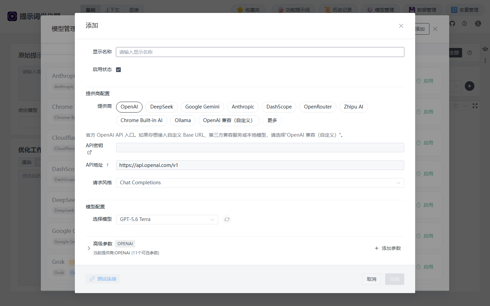
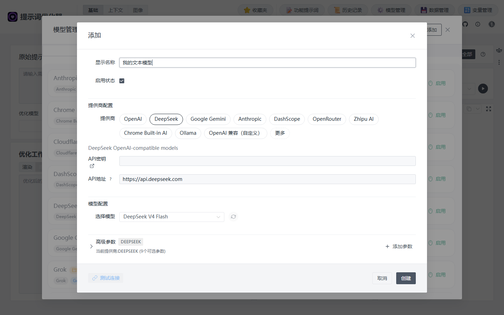

# 模型管理

Prompt Optimizer 使用你接入的模型来分析、优化和测试提示词。第一次使用，先配 **1 个文本模型**，完成一次优化；需要生成图片时，再添加图像模型。

## 开始前准备什么 {#before-you-start}

在线模型通常需要该模型平台的 **API Key**。请到你使用的平台控制台开通 API 服务并创建密钥；模型管理表单中 **API密钥** 旁的外链也可以带你前往对应平台。API Key 是平台颁发的调用凭证，不是你在 Prompt Optimizer 的登录密码。聊天产品会员和 API 调用资格可能分别管理，费用与额度以提供商控制台为准。

如果你还没有模型平台账号，可以先选择一个产品内置支持、你能获取 API Key 的提供商。不要把真实密钥发给别人或放进截图。使用本地 Ollama 等模型则按本页后面的[本地模型](#local-model)配置。

## 一次配好一个文本模型 {#first-text-model}

以下用界面中的 **DeepSeek** 提供商演示表单。它只是操作示例：你可以选择自己已有的提供商和账号可用的模型。截图拍摄于 2026 年 9 月，实际模型列表以当前界面和你的账户为准。

1. 打开[在线优化器](https://prompt.always200.com/#/basic/user)或桌面应用，点击顶部 **模型管理**。
2. 保持 **文本模型** 标签，点击右上角 **添加**。
3. 在表单中按下表填写，保持 **启用状态** 已勾选。

*表单初始选中 OpenAI；请切换到你实际使用的提供商。*

| 字段 | 这次怎么填 |
| --- | --- |
| 显示名称 | 自己容易认出的名字，例如“我的文本模型” |
| 提供商 | 选择 **DeepSeek**；使用其他平台时选对应名称 |
| API密钥 | 粘贴该平台控制台创建的 API Key。这里不要填聊天产品密码 |
| API地址 | 使用官方提供商时先保留界面自动填写的地址 |
| 选择模型 | 选择你的账号实际可调用的模型；名称会随提供商更新 |
| 高级参数 | 第一次使用先保持默认 |

*真实在线界面截图；API Key 留空，截图中的模型名称仅表示拍摄时的界面状态。*

4. 点击左下角 **测试连接**，等待成功提示；再点击 **创建**。列表里应出现你填写的显示名称，且模型处于启用状态。
5. 关闭模型管理，回到用户提示词工作区，在左侧 **优化模型** 中选择它。接着按[快速开始](../user/quick-start.md#enter-prompt)完成第一次优化。

如果测试连接失败，先核对密钥、账户额度和模型是否可用，再看[连接问题](../help/connection-issues.md)。**测试连接成功只证明该测试请求通过**；实际优化仍可能因额度、模型能力或网络状态失败。

## 各个字段是什么意思 {#fields}

- **显示名称**：只供你在应用里识别配置。它可以叫“工作用模型”，不影响平台实际调用。
- **提供商**：决定接口适配和默认地址。官方平台选同名提供商；第三方兼容服务选 **OpenAI 兼容（自定义）**。
- **API密钥**：模型平台颁发的调用凭证。不要公开或写入公开部署的前端环境变量。
- **API地址**：请求发往哪里。使用内置官方提供商时通常保留默认值；自定义服务按服务商说明填写。
- **选择模型**：实际调用的模型。先确认账户有权使用它；显示名称和模型 ID 是两回事。
- **请求风格、高级参数**：只在提供商或模型明确要求时调整。

## 需要几个模型 {#model-types}

| 你想做的事 | 先准备什么 |
| --- | --- |
| 优化并复制一条文字提示词 | 1 个文本模型 |
| 用同一个模型比较原始和优化版的输出 | 仍然只需这 1 个文本模型 |
| 比较不同模型的输出 | 再添加第 2 个文本模型 |
| 优化图像提示词并实际出图 | 1 个文本模型 + 1 个图像模型 |
| 从参考图提取内容、复刻或学习风格 | 根据功能再配置支持识图的功能模型 |

在文字工作区，左侧 **优化模型** 改写提示词；右侧的模型实际执行提示词。第一次使用可以选同一个模型。结果评估也会调用文本模型；评估入口实际选用哪个模型，取决于当前工作区的测试模型选择和评估设置，具体看[测试与评估](../user/testing-evaluation.md)。

## 其他接入方式 {#other-providers}

### 其他官方模型平台

在 **添加** 表单选择对应提供商，填写该平台的 API Key，再选择账号可用模型并测试连接。界面里有些服务商的密钥外链可直接打开官方控制台。请保留自动填写的 API 地址，除非平台明确要求改动。

### 本地模型 {#local-model}

使用 Ollama 时，选择内置的 **Ollama** 提供商；启动 Ollama 并安装模型后，在表单中选择本机已有的模型。默认地址通常是 `http://localhost:11434/v1`，一般不需要 API Key。具体模型名称以本机实际安装列表为准。

LM Studio 或其他 OpenAI 兼容服务可选 **OpenAI 兼容（自定义）**，填服务实际提供的地址、模型 ID，以及服务要求的密钥。连接本机或局域网 HTTP 服务时，优先使用[桌面应用](../deployment/desktop.md)；浏览器版可能受到网络与跨域限制。

### 图像与功能模型

要出图，在模型管理的 **图像模型** 标签添加生成模型；左侧优化图像提示词仍需要文本模型。参考图复刻、风格学习等识图动作还需在 **功能模型** 中选择可识图的模型。具体要求见[文生图工作区](../image/text2image-workspace.md)。

## 常见卡点 {#setup-problems}

| 看到的现象 | 先检查什么 |
| --- | --- |
| 左侧 **优化模型** 里找不到刚添加的模型 | 是否点击 **创建**、配置是否启用、是否在 **文本模型** 标签中添加 |
| `401` 或认证失败 | API Key 是否来自所选提供商、是否多了空格、账户是否可用 |
| `404` 或模型不存在 | 所选模型是否确实在账户中可用，地址是否对应提供商 |
| 浏览器报网络错误或 CORS | 查看[连接问题](../help/connection-issues.md)，本地接口可试桌面版 |
| 连接测试通过，优化仍失败 | 检查运行时的额度、模型与错误详情；测试连接不等于所有请求都会成功 |

配置保存在你当前使用的浏览器、桌面应用或扩展环境中。迁移前使用[数据管理](data.md)备份，分享备份前检查其中是否含 API Key。
