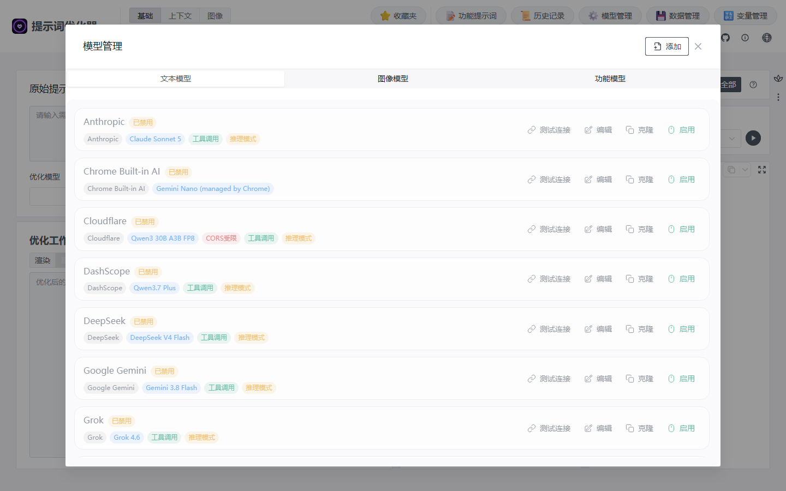
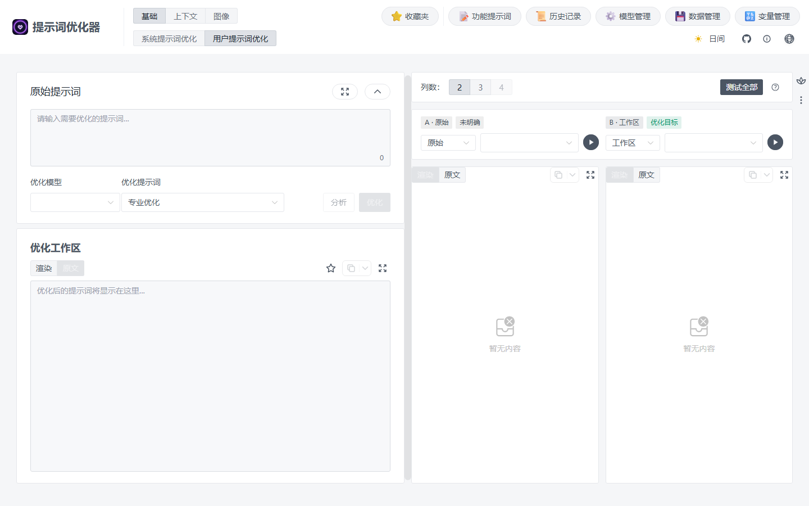
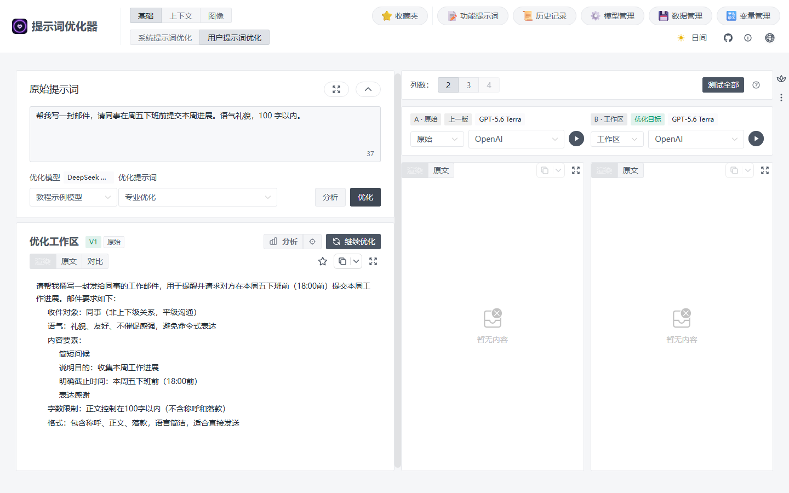

# 快速开始：完成第一次提示词优化

这份教程从准备模型开始，带你优化一条提示词并复制结果。第一次使用只需要一个可用的文本模型。

!!! warning "开始前先确认"
    Prompt Optimizer 不提供可直接调用的在线模型。你需要自己的模型平台 API Key，或已经运行的本地模型。聊天产品的会员与 API 服务可能分开管理，请以你使用的平台说明为准。[模型管理](../basic/models.md)提供完整配置步骤。

## 1. 配置一个文本模型

1. 打开[在线优化器](https://prompt.always200.com/#/basic/user)或桌面应用。
2. 点击顶部 **模型管理**，保持 **文本模型** 标签，点击右上角 **添加**。
3. 填写显示名称，选择你有 API Key 的提供商，填写 **API密钥**，在 **选择模型** 中选择账号可用的模型。使用官方提供商时，可以先保留自动填写的 **API地址**。
4. 点击 **测试连接**。成功后点击 **创建**，确认这个模型处于启用状态。

如果还没有 API Key，先看[模型管理：开始前准备什么](../basic/models.md#before-you-start)。连接失败则看[连接问题](../help/connection-issues.md)。

*截图来自未配置密钥的在线站。列表中的预置项未启用；填写自己的配置并测试成功后才能运行。*

## 2. 输入一条任务提示词 {#enter-prompt}

进入顶部 **基础 → 用户提示词优化**。在左侧 **原始提示词** 输入：

> 帮我写一封邮件，请同事在周五下班前提交本周进展。语气礼貌，100 字以内。

在左侧 **优化模型** 中选择刚配置的模型；**优化提示词** 暂时保留默认的 **专业优化**。

*截图展示入口位置，拍摄时未填入示例文本和模型密钥。*

## 3. 优化并复制结果

点击左侧 **优化**。等待生成结束后，在下方 **优化工作区** 查看改写后的提示词，点击复制按钮。你可以把这段提示词发给实际使用的模型。

*这是一次真实运行的结果。模型把“下班前”自行具体化成了“18:00 前”，原文并没有给出这个时间。复制前请核对并改掉不符合实际的补充内容。截图右侧仍是默认测试模型，后续测试时应选择自己已配置的模型。*

这一步得到的是**改写后的任务要求**，不是最终邮件。想在本应用里看看模型按这条要求写出的邮件，再到右侧运行测试。

如果 **优化** 按钮不可用，先检查原始提示词是否已填写、**优化模型** 是否选中且启用。若运行时报错，回到 **模型管理** 重新测试连接；详见[故障排除](../help/troubleshooting.md)。

## 接下来做什么

- 想知道改写是否有效：看[测试与评估](testing-evaluation.md)，用同一个模型测试原始提示词和优化工作区。
- 想保存这条提示词：看[收藏与导入](../basic/favorites.md)。
- 想优化角色设定、变量模板或图片提示词：看[选择工作区](choose-workspace.md)。

只想先试用，到这里就完成了第一次优化。图像功能需要额外配置图像模型；[模型管理](../basic/models.md#model-types)说明各类模型的用途。
